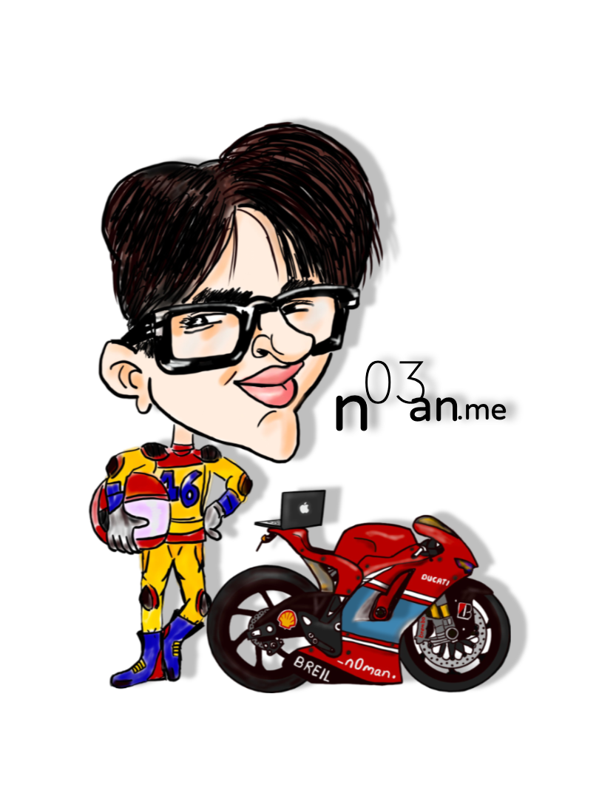

<section>
  

    

      2028
      374
      1268
      11478
      374
      1903
      13
    

    <ul class="code">
      <li tabindex="0" class="digit">
        This
      </li>
      <li tabindex="0" class="digit">
        is
      </li>
      <li tabindex="0" class="digit">
        how
      </li>
      <li tabindex="0" class="digit">
        intelligence
      </li>
      <li tabindex="0" class="digit">
        is
      </li>
      <li tabindex="0" class="digit">
        made
      </li>
      <li tabindex="0" class="digit">
        .
      </li>
    </ul>
  

</section>

