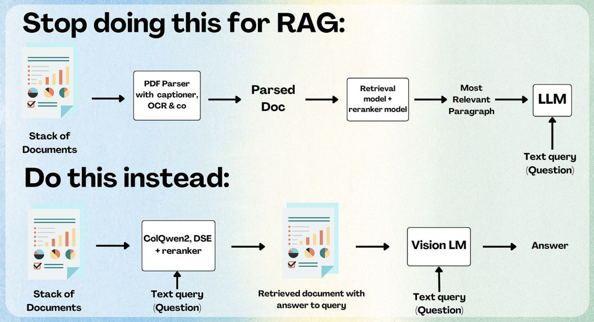

show step by step for multi vector embedding approach in ColPali with math formulate and python code while answering question on a text image



[](https://www.bentoml.com/blog/deploying-colpali-with-bentoml)

Certainly! Let's delve into the **multi-vector embedding approach** employed by **ColPali**, particularly in the context of answering questions on a text image, step by step, with mathematical formulations and Python code.

---

## 🔍 Step-by-Step: ColPali's Multi-Vector Embedding Approach

### 1. **Document Preprocessing**

**Input**: A **PDF document** containing text and images.

**Process**:

- **OCR (Optical Character Recognition)**: Extracts text from the document.
- **Layout Analysis**: Identifies the structure of the document, such as headings, paragraphs, and images.

**Output**: Structured data representing the document's content and layout.

### 2. **Image Embedding with Vision Language Model (VLM)**

**Input**: Images extracted from the document.

**Process**:

- **VLM Encoding**: Each image is processed by a Vision Language Model (e.g., Qwen) to generate embeddings.

**Output**: A set of embeddings representing the visual content of the images.

### 3. **Text Embedding with Language Model**

**Input**: Text extracted from the document.

**Process**:

- **Text Encoding**: The extracted text is processed by a language model to generate embeddings.

**Output**: A set of embeddings representing the textual content of the document.

### 4. **Multi-Vector Embedding Storage**

**Input**: Embeddings from both text and images.

**Process**:

- **Storage**: The embeddings are stored in a vector database (e.g., Qdrant, Milvus) that supports multi-vector indexing.

**Output**: A searchable index of embeddings.

### 5. **Query Processing**

**Input**: A user query, which may include both text and images.

**Process**:

- **Text Query Encoding**: The text part of the query is processed by the language model to generate embeddings.
- **Image Query Encoding**: The image part of the query is processed by the VLM to generate embeddings.

**Output**: Embeddings representing the user's query.

### 6. **Similarity Search**

**Input**: Query embeddings and stored embeddings.

**Process**:

- **Similarity Calculation**: The query embeddings are compared with the stored embeddings using a similarity metric (e.g., cosine similarity).

**Output**: A ranked list of document segments most relevant to the query.

### 7. **Late Interaction Matching**

**Input**: Ranked document segments and the user's query.

**Process**:

- **Late Interaction**: A matching mechanism is applied to refine the relevance of the retrieved segments.

**Output**: The most relevant document segments are selected.

### 8. **Answer Generation**

**Input**: Selected document segments and the user's query.

**Process**:

- **Answer Extraction**: The relevant information is extracted to form an answer to the user's query.

**Output**: A concise answer to the user's question.

---

## 🧮 Mathematical Formulation

Let:

- $\mathbf{q}$ be the query embedding.
- $\mathbf{d}_i$ be the embedding of the $i$-th document segment.
- $\text{sim}(\cdot, \cdot)$ be a similarity function (e.g., cosine similarity).

The similarity between the query and a document segment is computed as:

$$
\text{sim}(\mathbf{q}, \mathbf{d}_i) = \frac{\mathbf{q} \cdot \mathbf{d}_i}{\|\mathbf{q}\| \|\mathbf{d}_i\|}
$$

The document segments are ranked based on this similarity score.

---

## 🐍 Python Code Example

```python
import numpy as np
from sklearn.metrics.pairwise import cosine_similarity

# Example embeddings
query_embedding = np.random.rand(1, 768)
document_embeddings = np.random.rand(10, 768)

# Compute cosine similarity
similarities = cosine_similarity(query_embedding, document_embeddings)

# Rank document segments
ranked_indices = np.argsort(similarities[0])[::-1]
top_k_indices = ranked_indices[:3]

print("Top 3 most relevant document segments:", top_k_indices)
```

---

## ⚠️ Considerations

- **Scalability**: Handling a large number of embeddings can be computationally intensive. Techniques like **quantization** and **approximate nearest neighbor search** can help mitigate this.

- **Storage**: Multi-vector embeddings require more storage space. Efficient storage solutions are necessary to manage this increased demand.

- **Latency**: The multi-step process can introduce latency. Optimizations are essential to ensure timely responses.

---

## 🧠 Summary

ColPali's multi-vector embedding approach leverages both textual and visual information to provide a comprehensive understanding of document content. By processing text and images separately and then combining their embeddings, ColPali enhances the accuracy and relevance of document retrieval and question answering tasks.

If you have further questions or need more detailed information on any of these steps, feel free to ask!

---

Queston
can you do cosine similarity between text and image embeddings between input and trained multi vector embeddings?

Yes, you **can compute cosine similarity between text and image embeddings**, but only **if the embeddings are aligned in the same vector space** — which is typically the case with **Vision-Language Models (VLMs)** that are **jointly trained on text and image data** (e.g., CLIP, Flamingo, BLIP, or Qwen-VL).

---

## ✅ When Cosine Similarity Between Text & Image Embeddings Works

### 🔗 **Multimodal Alignment**

- In models like **CLIP** (Contrastive Language–Image Pretraining), both the text encoder and image encoder are trained **together**, with contrastive loss, to align text and image embeddings.
- As a result:

  - Embedding(`"a photo of a cat"`) ≈ Embedding(cat_image)
  - Cosine similarity can **quantify how similar** a piece of text is to an image.

---

## 🧠 Conceptual Example

Let’s say we have:

- A **text query**: `"a red apple"`
- An **image** (of a red apple)

### Step 1: Encode text and image into the **same latent space**

```python
text_embedding = text_encoder("a red apple")     # shape: (1, 512)
image_embedding = image_encoder(apple_image)     # shape: (1, 512)
```

### Step 2: Compute cosine similarity

```python
from sklearn.metrics.pairwise import cosine_similarity

similarity = cosine_similarity(text_embedding, image_embedding)
print("Similarity:", similarity[0][0])
```

### 🧮 Cosine Similarity Formula

$$
\text{cosine\_sim}(\mathbf{a}, \mathbf{b}) = \frac{\mathbf{a} \cdot \mathbf{b}}{\|\mathbf{a}\| \|\mathbf{b}\|}
$$

---

## 🔍 Application in ColPali-like Systems

In systems like **ColPali**, which extend **ColBERT** into multimodal domains:

- Each document may have **text tokens** and **image patches** encoded into vectors.
- These are stored as **multi-vector embeddings**.
- A query (text and/or image) is also decomposed into vectors.
- Cosine similarity (or MaxSim across tokens) is used to compute relevance:

### 🧠 MaxSim with Cross-Modal Vectors

$$
\text{score}(Q, D) = \sum_{q \in Q} \max_{d \in D} \text{sim}(q, d)
$$

Where:

- $Q$: query vectors (from text and/or image)
- $D$: document vectors (from text and/or image)
- $\text{sim}$: cosine similarity (since text and image embeddings are aligned)

---

## ⚠️ Important Caveats

| ✅ Works                                                 | ❌ Doesn't Work                                                     |
| -------------------------------------------------------- | ------------------------------------------------------------------- |
| When using **jointly trained VLMs** (e.g. CLIP, Qwen-VL) | When using **separate models** for text and image without alignment |
| Same dimensionality (e.g., 512 or 768)                   | Different spaces (e.g., GPT for text and ResNet for image)          |

---

## ✅ Summary

Yes, you can compute cosine similarity between image and text embeddings **only if they're produced by a model trained to align those modalities** (like CLIP or Qwen-VL). This is **how ColPali-style retrieval systems compare multimodal queries to multimodal documents**.

Let me know if you want a code demo using CLIP or another multimodal model!
