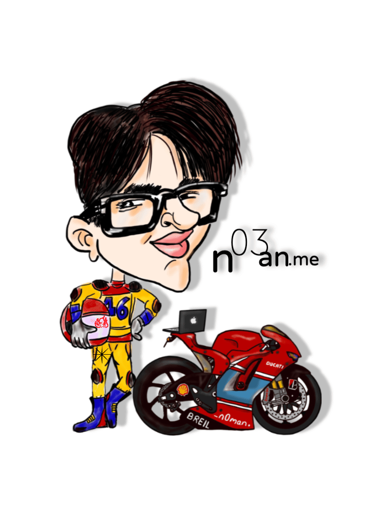

<section>
  

    

      2028
      374
      1268
      11478
      374
      1903
      13
    

    <ul class="code">
      <li tabindex="0" class="digit">
        This
      </li>
      <li tabindex="0" class="digit">
        is
      </li>
      <li tabindex="0" class="digit">
        how
      </li>
      <li tabindex="0" class="digit">
        intelligence
      </li>
      <li tabindex="0" class="digit">
        is
      </li>
      <li tabindex="0" class="digit">
        made
      </li>
      <li tabindex="0" class="digit">
        .
      </li>
    </ul>
  

</section>

<!-- Narrative -->
 

  
<b style="font-size:1.1em">Meet Nouman </b>(pronounced "noo-mahn" — not "no man")...and I am Certified Human™ writing code for living.

 
  
<b style="font-size:1.1em">Once Upon a Time...🖋️</b> Math and I had a toxic relationship because it always seemed so unnecessarily complicated and irrelevant beyond day-to-day simple arithmetic. Having a masters in Computer Science, it only tells me that our education system is great at teaching you to nod at concepts you’ll <em>"totally use someday"... somewhere... for something... 🤷 you cant imagine while studying</em>

  
<b style="font-size:1.1em">then ChatGPT 🤖 happened to most of us after Corona 🦠</b>, and the term “TOKENS” were in most human neurons. My tech ego took a hit, purely out of frustration of not understanding what does it mean AND how the heck ChatGPT is able to respond like a confident super human? I dove down the rabbit hole 🐇 of understanding its internals, ~*~which led to my first positive attraction to Math❣️~*~ when I wrote my first <a href="https://n03an.me/Neural_Networks.html">tiny Neural Network</a>  as part of  an assignment in MIT DeepLearning <a href="https://courses.edx.org/certificates/27f8bff770cd44b59e1624a0fdf0942d">MicroMaster program</a>…

   
   
  
<b style="font-size:1.3em">🌐 What iss this website?</b> </b>glad You pretenDed to ask! 

  <ul>
      <li class="li-effect"><strong>Meta Nouman™:</strong> its still in fashion to have your single pager meta information to let people interested in you know about you</li>
      <li class="li-effect"><strong>n03an.me...</strong> I could fancy some weird domain that sounds like my name because adulthood lets you do weird things— no?</li>
      <li class="li-effect"><strong>and Finally</strong>, I have tons of unorganized digital junk, and I want to get into the habit of cleansing some decent AI-related notes that I can publish to reference on the fly (Progress: 0.001%)</li>
  </ul>

   
  
<b style="font-size:1.3em">👋 If You're Still Reading </b>

  
<b><em>Ciao!</em></b> You’re now legally obligated to judge my life choices 💡...

  

  ... Oh wait, BTW if you’re wondering 
      2028
      374
      1268
      11478
      374
      1903
      13
      what this is, then <a href="https://www.youtube.com/watch?v=_waPvOwL9Z8">help yourself</a> ...
    

<!-- Self -->

<section style="text-align: center; font-family: sans-serif;">
  
<b style="text-align: center; font-size:2rem">Connect With Me </b>

  

    Find me across the digital universe
  

  
  

    
  <!-- LinkedIn -->
  <a href="https://www.linkedin.com/in/n03an/" style="display: flex; align-items: center; justify-content: center; 
        width: 50px; height: 50px; border-radius: 50%; background: #0A66C2; 
        color: white; text-decoration: none; transition: transform 0.2s ease;">
    <svg style="width: 24px; height: 24px;" viewBox="0 0 24 24">
      <path fill="currentColor" d="M19 3a2 2 0 0 1 2 2v14a2 2 0 0 1-2 2H5a2 2 0 0 1-2-2V5a2 2 0 0 1 2-2h14m-.5 15.5v-5.3a3.26 3.26 0 0 0-3.26-3.26c-.85 0-1.84.52-2.32 1.3v-1.11h-2.79v8.37h2.79v-4.93c0-.77.62-1.4 1.39-1.4a1.4 1.4 0 0 1 1.4 1.4v4.93h2.79M6.88 8.56a1.68 1.68 0 0 0 1.68-1.68c0-.93-.75-1.69-1.68-1.69a1.69 1.69 0 0 0-1.69 1.69c0 .93.76 1.68 1.69 1.68m1.39 9.94v-8.37H5.5v8.37h2.77z"/>
    </svg>
  </a>

  <!-- GitHub -->

<a href="https://github.com/N0-man" style="display: flex; align-items: center; justify-content: center; 
        width: 50px; height: 50px; border-radius: 50%; background: #181717; 
        color: white; text-decoration: none; transition: transform 0.2s ease;">
<svg style="width: 24px; height: 24px;" viewBox="0 0 24 24">
<path fill="currentColor" d="M12 2A10 10 0 0 0 2 12c0 4.42 2.87 8.17 6.84 9.5.5.08.66-.23.66-.5v-1.69c-2.77.6-3.36-1.34-3.36-1.34-.46-1.16-1.11-1.47-1.11-1.47-.91-.62.07-.6.07-.6 1 .07 1.53 1.03 1.53 1.03.87 1.52 2.34 1.07 2.91.83.09-.65.35-1.09.63-1.34-2.22-.25-4.55-1.11-4.55-4.92 0-1.11.38-2 1.03-2.71-.1-.25-.45-1.29.1-2.64 0 0 .84-.27 2.75 1.02.79-.22 1.65-.33 2.5-.33.85 0 1.71.11 2.5.33 1.91-1.29 2.75-1.02 2.75-1.02.55 1.35.2 2.39.1 2.64.65.71 1.03 1.6 1.03 2.71 0 3.82-2.34 4.66-4.57 4.91.36.31.69.92.69 1.85V21c0 .27.16.59.67.5C19.14 20.16 22 16.42 22 12A10 10 0 0 0 12 2z"/>
</svg>
</a>

  <!-- Email -->

<a href="mailto:nouman.memon@icloud.com" style="display: flex; align-items: center; justify-content: center; 
        width: 50px; height: 50px; border-radius: 50%; background: #EA4335; 
        color: white; text-decoration: none; transition: transform 0.2s ease;">
<svg style="width: 24px; height: 24px;" viewBox="0 0 24 24">
<path fill="currentColor" d="M20 4H4c-1.1 0-1.99.9-1.99 2L2 18c0 1.1.9 2 2 2h16c1.1 0 2-.9 2-2V6c0-1.1-.9-2-2-2zm0 4l-8 5-8-5V6l8 5 8-5v2z"/>
</svg>
</a>

  <!-- X (Twitter) -->

<a href="https://x.com/n03an_me" style="display: flex; align-items: center; justify-content: center; 
        width: 50px; height: 50px; border-radius: 50%; background: #000; 
        color: white; text-decoration: none; transition: transform 0.2s ease;">
<svg style="width: 24px; height: 24px;" viewBox="0 0 24 24">
<path fill="currentColor" d="M18.901 1.153h3.68l-8.04 9.19L24 22.846h-7.406l-5.8-7.584-6.638 7.584H.474l8.6-9.83L0 1.154h7.594l5.243 6.932ZM17.61 20.644h2.039L6.486 3.24H4.298Z"/>
</svg>
</a>

  <!-- Instagram -->

<a href="https://www.instagram.com/n03an.me/" style="display: flex; align-items: center; justify-content: center; 
        width: 50px; height: 50px; border-radius: 50%; background: #E4405F; 
        color: white; text-decoration: none; transition: transform 0.2s ease;">
<svg style="width: 24px; height: 24px;" viewBox="0 0 24 24">
<path fill="currentColor" d="M7.8 2h8.4C19.4 2 22 4.6 22 7.8v8.4a5.8 5.8 0 0 1-5.8 5.8H7.8C4.6 22 2 19.4 2 16.2V7.8A5.8 5.8 0 0 1 7.8 2m-.2 2A3.6 3.6 0 0 0 4 7.6v8.8C4 18.39 5.61 20 7.6 20h8.8a3.6 3.6 0 0 0 3.6-3.6V7.6C20 5.61 18.39 4 16.4 4H7.6m9.65 1.5a1.25 1.25 0 0 1 1.25 1.25A1.25 1.25 0 0 1 17.25 8 1.25 1.25 0 0 1 16 6.75a1.25 1.25 0 0 1 1.25-1.25M12 7a5 5 0 0 1 5 5 5 5 0 0 1-5 5 5 5 0 0 1-5-5 5 5 0 0 1 5-5m0 2a3 3 0 0 0-3 3 3 3 0 0 0 3 3 3 3 0 0 0 3-3 3 3 0 0 0-3-3Z"/>
</svg>
</a>

  <!-- Facebook -->

<a href="https://www.facebook.com/nouman.memon.50" style="display: flex; align-items: center; justify-content: center; 
          width: 50px; height: 50px; border-radius: 50%; background: #1877F2; 
          color: white; text-decoration: none; transition: transform 0.2s ease;">
<svg style="width: 24px; height: 24px;" viewBox="0 0 24 24">
<path fill="currentColor" d="M24 12.073c0-6.627-5.373-12-12-12S0 5.446 0 12.073C0 18.1 4.388 23.02 10.125 24v-8.437H7.078v-3.49h3.047v-2.66c0-3.025 1.792-4.697 4.533-4.697 1.312 0 2.686.234 2.686.234v2.953H15.83c-1.491 0-1.956.925-1.956 1.875v2.25h3.328l-.532 3.49h-2.796V24C19.612 23.02 24 18.1 24 12.073z"/>
</svg>
</a>

  <!-- Flickr -->

<a href="https://www.flickr.com/photos/nouman_memon" style="display: flex; align-items: center; justify-content: center; 
        width: 50px; height: 50px; border-radius: 50%; background: #FF0084; 
        color: white; text-decoration: none; transition: transform 0.2s ease;">
<svg style="width: 24px; height: 24px;" viewBox="0 0 24 24">
<path fill="currentColor" d="M0 12c0 3.074 2.468 5.564 5.511 5.564 3.023 0 5.487-2.49 5.487-5.564S8.534 6.436 5.511 6.436C2.468 6.436 0 8.926 0 12zm12.974 0c0 3.074 2.467 5.564 5.511 5.564C21.53 17.564 24 15.074 24 12s-2.468-5.564-5.511-5.564c-3.046 0-5.515 2.49-5.515 5.564z"/>
</svg>
</a>

  

</section>

